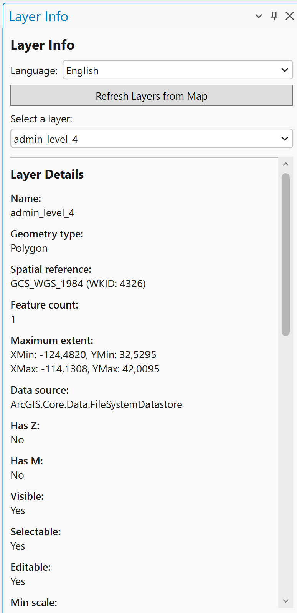

# Layer Info for ArcGIS Pro

An ArcGIS Pro Add-In that provides a convenient dockable panel to inspect feature layer properties directly from the active map.

## Features

- **Layer Inspector** – Select any feature layer from the active map and instantly view detailed metadata including:
  - Layer name
  - Geometry type (Point, Polyline, Polygon, etc.)
  - Spatial reference system (name and WKID)
  - Feature count
  - Maximum extent (XMin, YMin, XMax, YMax)
  - Data source path
  - Z and M coordinate support
  - Visibility, selectability, and editability status
  - Min/max scale thresholds
  - Active definition query
  - Full field list with data types

- **Auto-refresh** – Layer details update automatically when a new layer is selected from the dropdown.

- **Multi-language support** – The UI can be switched between **Italian**, **English**, and **Spanish** at any time via a language selector.

- **Robust data source handling** – Gracefully handles non-standard data sources (e.g., GeoPackage, WFS) without crashing.

## Requirements

- ArcGIS Pro 3.5+
- .NET 8.0

## Installation

1. Build the solution in Visual Studio.
2. The compiled `.esriAddinX` file will be located in the output directory.
3. Double-click the file to install the Add-In into ArcGIS Pro.

## Usage

1. Open ArcGIS Pro and load a map with one or more feature layers.
2. Navigate to the **Add-In** tab in the ribbon.
3. Click the **Layer Info** button to open the dockable panel.
4. Click **Refresh Layers from Map** to populate the layer dropdown.
5. Select a layer from the dropdown to view its details.
6. Optionally, change the display language using the language selector at the top of the panel.

## Project Structure

| File | Description |
|---|---|
| `Config.daml` | Add-In manifest – registers the button, dockpane, and module |
| `Module1.cs` | Add-In module entry point |
| `LayerInfoButton.cs` | Ribbon button that opens the Layer Info dockpane |
| `LayerInfoDockPaneViewModel.cs` | DockPane view model – layer inspection logic |
| `LayerInfoDockPaneView.xaml` | DockPane UI layout (WPF) |
| `LocalizationManager.cs` | Multi-language string management (IT, EN, ES) |

## License

This project is provided as-is for internal use.
